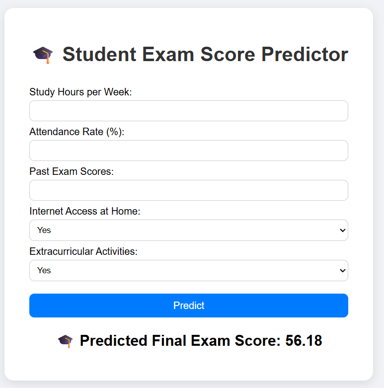

🎓 Student Exam Score Prediction Using Machine Learning

A simple Machine Learning web application built with Flask, HTML/CSS, and scikit-learn, which predicts a student’s final exam score based on their study habits, attendance, and other factors.

🚀 Project Overview

This project demonstrates how to build, train, and deploy a regression-based ML model that predicts the Final Exam Score of students based on several academic and behavioral features.

The frontend is built using HTML + CSS, while the backend uses Flask to serve predictions from the trained model.
The application is deployed using Render for easy access.

📊 Dataset Description

The dataset contains information about student performance including:

Feature	Description
Study_Hours_per_Week	Number of hours a student studies per week
Attendance_Rate	Percentage of attendance
Past_Exam_Scores	Average score of past exams
Internet_Access_at_Home_Yes	1 if student has internet access at home, else 0
Extracurricular_Activities_Yes	1 if student participates in extracurriculars, else 0
Target: Final_Exam_Score	Predicted output score

